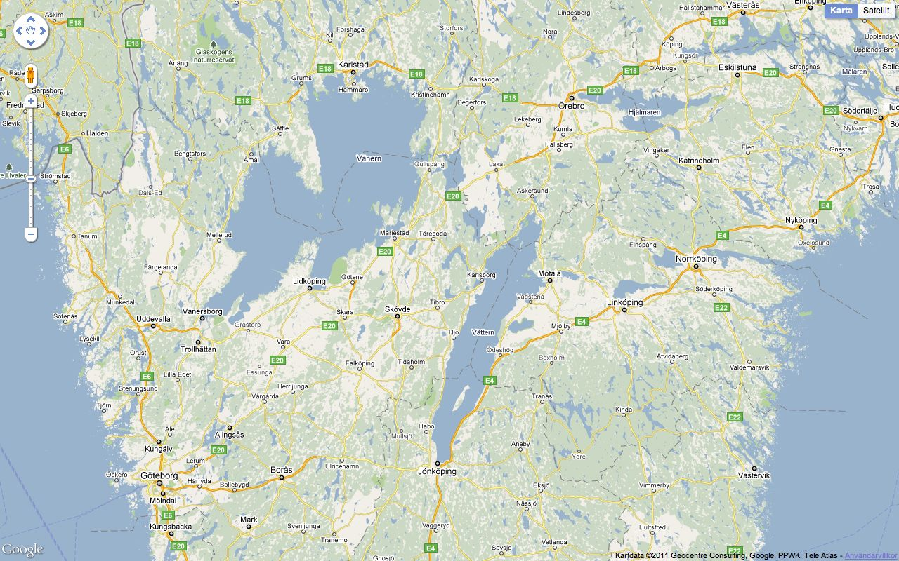
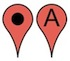
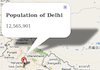
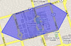

!SLIDE center light-on-dark

# Google maps #

!SLIDE full-page family

# The google maps family
## APIs ##
* Maps Javascript
* Maps Flash
* Static Maps
* Google Earth

## Web services ##
* Geocoding
* Directions
* Elevation
* Places
* Ad sense maps
* Transit

!SLIDE full-page
# Introduction, Google Maps V3#
* Released May 2009
* Completely re-written from V2
* No API-key needed
* Designed with mobile devices in mind

(demo in iOS simulator)

!SLIDE full-page
# Optimizations from V2 #
## Problems ##
* Alot of resources to load
* V2 code is 220KB
* iOS3 took 4.4sec just to parse
* UI blocks

## Enhancements ##
* Static pre-map for better UX
* More modular design
* Optimized "bootstrap" process
* Lower latency

!SLIDE full-page incremental
# GIS Basics gis
## Image tiles ##
  - Bitmap images
  - For all zoom levels
  - Non-interactive

## Primitives ##
  - Points
  - LineString
  - PolyLine

!SLIDE full-page
# Google Maps basics #
* Easy to get started with!
* Include library:

``

* Instantiate maps with options:

`var map = new google.maps.Map(<DOM Element>, { ... });`

* Control width/height with CSS

!SLIDE full-page googlemap
# Standard Google map #
This is what you get!

  

  

!SLIDE full-page features
# Some Google maps features
Google maps has quite alot of built in features ready to be used. Here are a few:
 

### Marker ###
`var marker = new google.maps.Marker({...});`
### Info Window ###
`var info = new google.maps.InfoWindow({...});`
### Circles/Rectangles/Polygons ###
`var cicle = new google.maps.Circle({...});`

### See them all at [Google Maps Javascript API V3 Overlays](http://code.google.com/intl/sv-SE/apis/maps/documentation/javascript/overlays.html) ###
