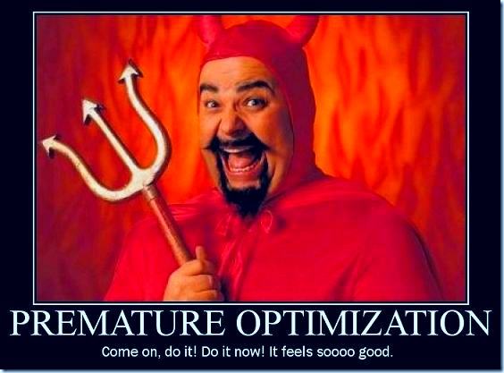
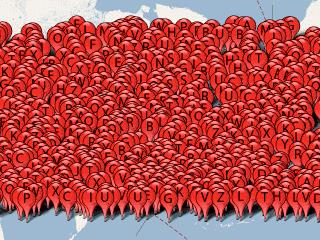
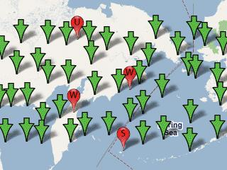
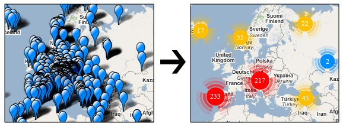

!SLIDE center light-on-dark

# 3. Performance #

<!--
Image cred to:
http://thefixedgear.wordpress.com/
-->

<!--
How do you handle 30 000 markers on a maps?
How do you handle highres lines or data heavy applications?

* user perceived latency – how long it takes for the page to appear usable, in
this case for the map to be rendered
* page ready time - how long it takes for the page to become usable, e.g. for
the map to be draggable

-->

!SLIDE full-page googlemap_perf1

# Why?

<button id="addmarkers">Add 100 Markers</button>
<button id="clearmarkers">Clear Markers</button>

  

  

(livedemo, markers)
<!--
* Too many markers on the map
* Marker rendering is slow
* To much data, load time
* Many js-objects or DOM elements
* Usability problem
-->

<!--
# Solution? Depends on reqs?
* map interaction
* information detail on different levels
* target platform, ipad or chrome
* data structure, volatile, size, update frequency
-->

!SLIDE full-page

# Knuth?

<!--
how do you measure it, find problems

-->

!SLIDE full-page

# Measure it
 * Chrome developer tools or Firebug
   * Network time for request
   * Profiling, function calls
 * http://jsperf.com/browse
 * Online Marker tests
 * Try different browsers

!SLIDE full-page

# Methods of improvement

!SLIDE full-page

# Clustering

<!--
Images by Martin Pearman, http://googlemapsapi.martinpearman.co.uk/

a few techniques

first clustering

what is it
-->
!SLIDE full-page

# Clustering
* Grid-based Clustering
* Area Clustering
* Distance based clustering
* [K-means clustering](http://en.wikipedia.org/wiki/K-means_clustering)
* [Article: Clustering basics](http://home.dei.polimi.it/matteucc/Clustering/tutorial_html/)

<!--
# Clustering
  * Client side clustering
  * Server side clustering

- Beratta att det finns lite olika tekniker, visa bilder lite snabbt
Often distance-based Clusteringm but attributes works good also
-->

!SLIDE full-page

# MarkerClusterer

[MarkerClusterer by google](http://google-maps-utility-library-v3.googlecode.com/svn/trunk/markerclusterer/examples/advanced_example.html)

!SLIDE full-page googlemap_perf2

# MarkerCluster 

<button id="addmarkerscluster">Add 100 Markers with MarkerClusterer</button>
<button id="clearmarkerscluster">Clear Markers</button>

  

  

<!--
all of you have probably seen this
what is it
settings
gridbased!
clientside
demo
-->

!SLIDE full-page

#MarkerManager (FIXA BILD)
[MarkerManger by google](http://google-maps-utility-library-v3.googlecode.com/svn/tags/markermanager/1.0/docs/reference.html)

<!--
MarkerManager
what is it
settings
demo
clientside
-->

!SLIDE full-page

# Server Side Clustering
<!--
what is it
why and when?
demo
hitta bra exempel!
http://www.usda.gov/recovery/map/
-->

!SLIDE full-page

# Add Layers
* Generated tiles
* Heatmaps
* FusionTables
* KML

<!--
FIXME: read heatmap api exmaple, visa
Generated tiles, how? tile server?
-->
!SLIDE full-page

#[Custom Tiles](http://maps.google.com/help/maps/elections/index.html#fundrace)

<iframe title="Us elections" width="800" height="410"
src="http://maps.google.com/help/maps/elections/index.html#fundrace"
framborder="0"></iframe>

!SLIDE full-page googlemap_perf3

# KML

  

  

!SLIDE full-page googlemap_perf4

# Google Fusion Tables (Beta!)FIXA LINK

  

  

<!--
google fusion table example
Vad erbjuder fusion table for maps
intensity map
markers with interaction, custom marker and overlay
sql-like api from your javascript!
-->

!SLIDE full-page

# Fetch data more efficient
* Slim down your protocol
* Fetch using boundingbox

<!-- ge ett exempel -->

!SLIDE full-page

# Data simplification - FIXA BILD
* Encoded polylines

<!--

http://code.google.com/intl/sv/apis/maps/documentation/javascript/geometry.html

# Performance Tips

* Supermarker
* Markerlight
* [Marker Test 1](http://gmaps-samples-v3.googlecode.com/svn/trunk/toomanymarkers/toomanymarkers.html)
* [Marker Test 2](http://www.svennerberg.com/examples/markers/markerPerformance.html)
* [SuperMarker style](http://nickjohnson.com/b/google-maps-v3-how-to-quickly-add-many-markers)

http://code.google.com/intl/sv-SE/apis/maps/documentation/utilities/polylinealgorithm.html
how to code polylines smart, raksträckor tex brezenhams?

DOM elements, listeners js objects
The latter pattern is more efficient, with 1 modification.  Rather than
creating a listener function in each call to .addListener(), create your
listener function once and add that same listener to all markers.  Reducing
the number of Objects like this helps older browsers especially.
Render GIFs for IE, instead of alpha PNGs
GMarker ger 5 DOM nodes, egen div ger div med img ger 2.

Render GIFs for IE, instead of alpha PNGs

* [Custom tiles?](https:////maptd.com/map/earthquake_activity_vs_nuclear_power_plants/)
* [Google Maps Mania](http://googlemapsmania.blogspot.com/)
* [Goole Maps Media gallery](http://code.google.com/intl/sv-SE/apis/maps/documentation/javascript/v2/mediagallery.html)
* [1](http://move.rmi.org/features/oilmap.html)
* [2](http://maptd.com/map/earthquake_activity_vs_nuclear_power_plants/)
* [3](http://www.redfin.com/homes-for-sale#!lat=37.78681721535732&long=-122.44922089716879&market=sanfrancisco&region_id=17151&region_type=6&sf=1,2&v=6&zoomLevel=12)
* [4](http://www.nytimes.com/interactive/2010/01/10/nyregion/20100110-netflix-map.html?src=tp)
* http://projects.nytimes.com/crime/homicides/map
* http://maptd.com/map/earthquake_activity_vs_nuclear_power_plants/
* http://boston.povo.com/Boston?heatmap&query=pizza&tags=pizza%2csandwiches,pasta&center=42.30879983710441,-71.0595703125&zoom=11
-->

