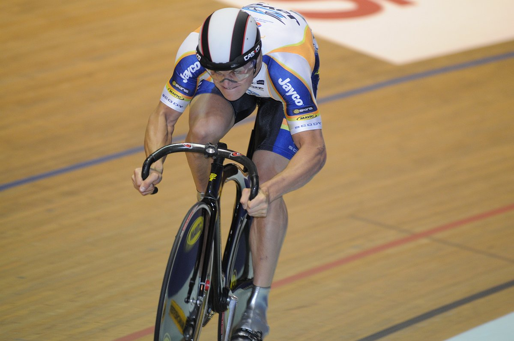

!SLIDE center light-on-dark

# 4. Performance #

<!--
Image cred to:
http://thefixedgear.wordpress.com/
-->

!SLIDE full-page googlemap_perf1

# Why?

<button id="addmarkers">Add 100 Markers</button>
<button id="clearmarkers">Clear Markers</button>

  

  

(livedemo, markers)

!SLIDE full-page

# Knuth?

!SLIDE full-page

# Measure it
 * Chrome developer tools or Firebug
   * Network time for request
   * Profiling, function calls
 * [http://jsperf.com/browse](http://jsperf.com/browse)
 * Online Marker tests
 * Try different browsers/computers

!SLIDE full-page

# Methods of improvement

!SLIDE full-page

# Clustering

!SLIDE full-page

# Clustering
* Grid-based Clustering
* Area Clustering
* Distance based clustering
* [K-means clustering](http://en.wikipedia.org/wiki/K-means_clustering)
* [Article: Clustering basics](http://home.dei.polimi.it/matteucc/Clustering/tutorial_html/)

!SLIDE full-page

# MarkerClusterer & MarkerManager

[MarkerManger by google](http://google-maps-utility-library-v3.googlecode.com/svn/tags/markermanager/1.0/docs/reference.html)
[MarkerClusterer by google](http://google-maps-utility-library-v3.googlecode.com/svn/trunk/markerclusterer/examples/advanced_example.html)

!SLIDE full-page googlemap_perf2

# MarkerClusterer

<button id="addmarkerscluster">Add 100 Markers with MarkerClusterer</button>
<button id="clearmarkerscluster">Clear Markers</button>

  

  

!SLIDE full-page

# Fetch data more efficient
* Slim down your protocol
* Fetch using boundingbox

<!-- ge ett exempel -->

!SLIDE full-page

# Data simplification

* Simplify data
* Encoded polylines

!SLIDE full-page

# Add Layers

    @@@ javascript
    var lay1 = new google.maps.KmlLayer('url/data.kmz');
    lay1.setMap(map);

    var lay2 = new google.maps.FusionTablesLayer(id);
    lay2.setQuery("SELECT * FROM " + id);
    lay2.setMap(map);

* Generated tiles
* Google Fusion Tables
* KML

!SLIDE full-page

#[Custom Tiles](http://maps.google.com/help/maps/elections/index.html#fundrace)

<iframe title="Us elections" width="800" height="410"
src="http://maps.google.com/help/maps/elections/index.html#fundrace"
framborder="0"></iframe>

!SLIDE full-page googlemap_perf3

# KML

  

  

!SLIDE full-page googlemap_perf4

# [Google Fusion Tables (Beta!)](http://www.google.com/fusiontables/DataSource?dsrcid=693476)

  

  

