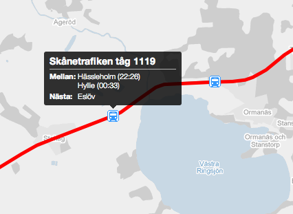

!SLIDE full-page
# Styling Google maps #
Unstyled is pretty boring...

!SLIDE full-page
# Custom marker #
By using Googles [Custom Overlay Class](http://code.google.com/intl/sv-SE/apis/maps/documentation/javascript/overlays.html#SubClassing) 
we can create our own marker using any HTML/CSS we want

!SLIDE full-page
# Custom tiles #
* Allows control of map features
* Allows simplification of features
* Allows control of map colors

!SLIDE full-page googlemap2
# Here we go! #
This is what google maps can look like

!SLIDE full-page
# Style notation #
    @@@ javascript
    {
      featureType: "water",
      elementType: "all",
      stylers: [
        { visibility: "on" },
        { hue: "#ff00bb" },
        { saturation: 100 }
      ]
    },{
      featureType: "landscape",
      elementType: "all",
      stylers: [
        { saturation: 94 },
        { hue: "#6e00ff" },
        { visibility: "off" }
      ]
    },
    ...
Try it at [Google custom style wizard](http://gmaps-samples-v3.googlecode.com/svn/trunk/styledmaps/wizard/index.html "Wizard")
