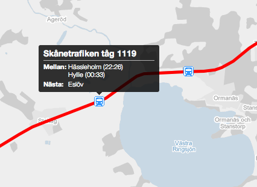
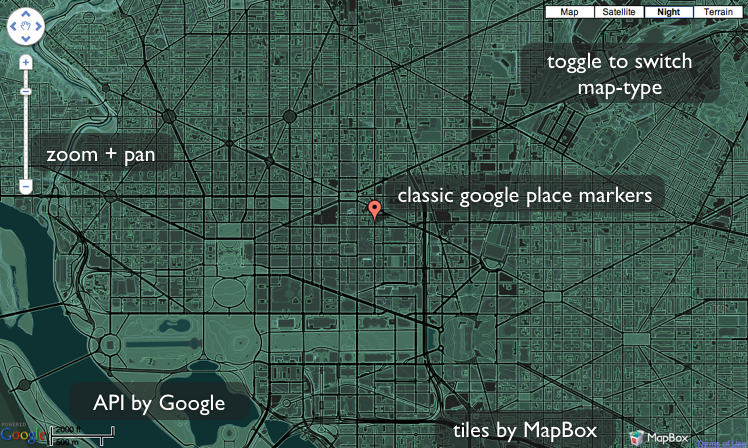

!SLIDE center light-on-dark

# 3. Styling Google maps #
### Unstyled is pretty boring... ###

!SLIDE full-page
# Custom marker #
By using Googles [Custom Overlay Class](http://code.google.com/intl/sv-SE/apis/maps/documentation/javascript/overlays.html#SubClassing)
we can create our own marker using any HTML/CSS we want

### Example from [taglaget.nu](http://taglaget.nu) ###

!SLIDE full-page
# Custom marker, code #
    @@@ javascript
    /* Create marker class */
    function MyMarker(...) { ... };
    /* "Subclass" OverlayView */
    MyMarker.prototype = new google.maps.OverlayView()
    /* Implement "virtual" functions */
    MyMarker.prototype.onAdd = function() { ... };
    MyMarker.prototype.draw = function() { ... };

### [Full example](http://code.google.com/intl/sv-SE/apis/maps/documentation/javascript/overlays.html#SubClassing) ###

!SLIDE full-page
# Custom tiles #
### From [may 2010](http://googlegeodevelopers.blogspot.com/2010/05/add-touch-of-style-to-your-maps.html) Google allows styling of their tiles: ###

* Control of map features
* Simplification of features
* Control of map colors

!SLIDE full-page googlemap2
# Here we go! #
This is what google maps can look like

  

  

!SLIDE full-page
# ' #
# Style notation #
    @@@ javascript
    {
      featureType: "water",
      elementType: "all",
      stylers: [
        { visibility: "on" },
        { hue: "#ff00bb" },
        { saturation: 100 }
      ]
    },{
      featureType: "landscape",
      elementType: "all",
      stylers: [
        { saturation: 94 },
        { hue: "#6e00ff" },
        { visibility: "off" }
      ]
    },
    ...
Try it at [Google custom style wizard](http://gmaps-samples-v3.googlecode.com/svn/trunk/styledmaps/wizard/index.html "Wizard")

!SLIDE full-page

# Custom Static Tiles

[Custom tiles with Mapbox](http://demo.mapbox.com/dc-nightvision.html)

!SLIDE full-page
# Custom controls #

* Default controls can be turned off

`disableDefaultUI: true /* in init-options */`

* Control map programatically

`map.setCenter(<LatLng>);`
`map.setZoom(<integer>);`

* Make controls with HTML/JS

!SLIDE full-page googlemap3
# Example: own zoom buttons #
<button id="zoomin">Zoom in</button>
<button id="zoomout">Zoom out</button>
<button id="gowest">Go west!</button>

  

  

